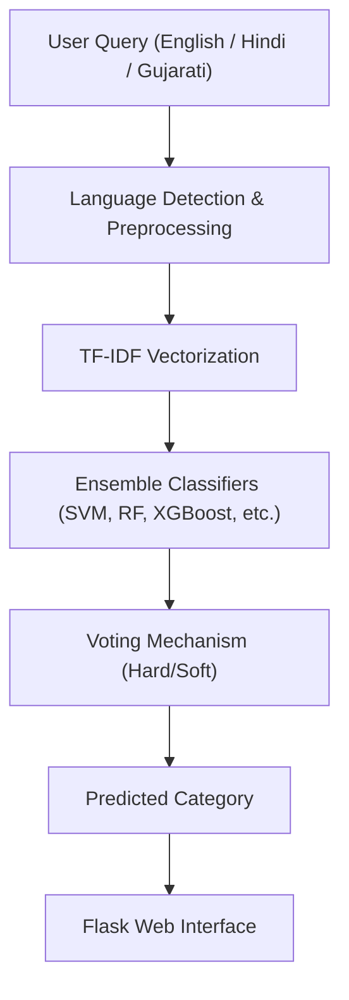

# Multilingual-Agricultural-Query-Classification-System

A multilingual AI system that classifies agricultural queries submitted in English, Hindi, or Gujarati into relevant categories using NLP and machine learning.

## Features

- Multilingual Support: Handles queries in English, Hindi, and Gujarati.
- Ensemble ML Models: Uses Naive Bayes, SVM, Logistic Regression, Random Forest, SGD, and XGBoost with voting strategies.
- High Accuracy: Achieved up to 71% F1-score (English), 68% (Hindi & Gujarati).
- Web Deployment: Flask-based app for real-time classification.
- Scalability: Designed to extend to more languages and advanced models like BERT, XLM-R.
- Farmer-Friendly: Classifies queries into 10 categories (e.g., Weather, Fertilizer, Government Schemes, Market Info).

  ***

---

## System Architecture



---

## Project Structure

Each folder serves a specific purpose:

- **data/** → Contains agricultural queries dataset.
- **notebooks/** → Jupyter notebooks used for experimentation, preprocessing, and model training.
- **models/** → Trained machine learning models saved for deployment.
- **app/** → Flask web application for serving predictions.
  - **app.py** → Entry point to start the Flask server.
  - **static/** → Frontend static assets (CSS/JavaScript).
  - **templates/** → HTML pages for rendering the web interface.
- **requirements.txt** → List of Python dependencies required to run the project.
- **README.md** → Documentation for the project.

---

## Installation & Setup

```bash
# 1. Clone the repo
git clone https://github.com/HarshitShahAI/Multilingual-Agricultural-Query-Classification-System.git
cd Multilingual-Agricultural-Query-Classification-System

# 2. Create a virtual environment
python -m venv venv
source venv/bin/activate   # On Mac/Linux
venv\Scripts\activate      # On Windows

# 3. Install dependencies
pip install -r requirements.txt

# 4. Run the Flask app
python app/app.py

# 5. Open in your browser:
http://127.0.0.1:5000/
```

---

## Dataset

- ~50,000 agricultural queries collected from forums, helplines, and community platforms.

- Categories include:
  - Cultural Practices
  - Fertilizer Use
  - Weather
  - Market Information
  - Government Schemes
  - Weed Management
  - Plant Protection
  - Nutrient Management
  - Varieties
  - Field Preparation

  ***

## Methodology

### Preprocessing

- Stopword removal (language-specific)
- Tokenization
- Stemming/Normalization
- Unicode filtering for Hindi/Gujarati

### Feature Extraction

- TF-IDF (word & character n-grams)

### Model Training

- Trained individual models: Naive Bayes (NB), Support Vector Machine (SVM), Random Forest (RF), Logistic Regression (LR), Stochastic Gradient Descent (SGD), XGBoost (XGB)
- Constructed voting ensembles (hard + soft voting)

### Evaluation Metric

- Micro F1-score (handles class imbalance effectively)

---

## Results

| Language     | Best Ensemble            | Micro F1-score |
| ------------ | ------------------------ | -------------- |
| English      | LR + RF + NB             | 0.71           |
| Hindi        | LR + RF + NB + SGD + XGB | 0.68           |
| Gujarati     | LR + RF + NB + SGD + XGB | 0.68           |
| Multilingual | LR + RF + NB + SGD + XGB | 0.42           |

---

## Demo

- Project Explanation Video
- GitHub Repository

## Tech Stack

- **Languages:** Python
- **Libraries:** scikit-learn, NLTK, Pandas, NumPy, XGBoost
- **Framework:** Flask
- **Frontend:** HTML, CSS

## Contributors

- Ramavath Pavan
- Harshit Shah
- Yash Joshi
- Diwyanshu
- Ashish

## Future Work

- Integrate transformer-based models (BERT, Indic-BERT, XLM-R)
- Add speech-to-text query input
- Expand to more Indian languages
- Optimize performance for deployment at scale
